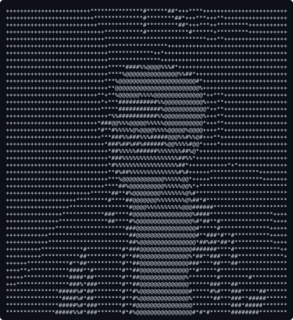
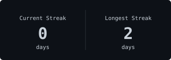
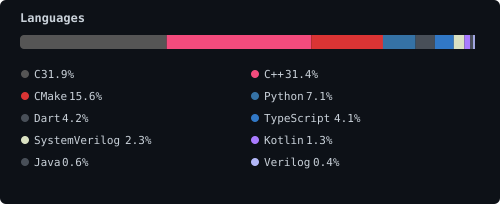

<!-- ╔══════════════════════════════════════════════════════════╗ -->
<!-- ║  Auto-generated README — do not edit manually.         ║ -->
<!-- ║  Source: templates/README.template.md                   ║ -->
<!-- ║  Last updated: 2026-08-29 05:01 UTC                        ║ -->
<!-- ╚══════════════════════════════════════════════════════════╝ -->

<div align="center">

<table>
<tr>
<td align="center" valign="top" width="300">



</td>
<td align="center" valign="top" width="500">


<br/>

```
 48 contributions this year
 12 active days  ·  best week: 22
 top language: C
```

</td>
</tr>
</table>

</div>

---

## `> whoami`

```
Muhammad Sohair Khan
```

Computer Engineering student at Sir Syed University of Engineering & Technology and IC Design Intern at NED University, building hardware integrations from RTL to SoC. I bridge the gap between bare-metal chip design and data-driven software — shipping FPGA accelerators, automated scraping pipelines, and full-stack web apps. A "jack of all trades, master of none, often times better than a master of one."

<p>
<a href="https://github.com/Muhammad-Sohair"><code>github.com/Muhammad-Sohair</code></a> ·
<a href="https://linkedin.com/in/sohairkhan"><code>linkedin.com/in/sohairkhan</code></a> ·
<a href="https://Sohair.tech"><code>sohair.tech</code></a> ·
<a href="mailto:m.sohairkhan320@gmail.com"><code>m.sohairkhan320@gmail.com</code></a>
</p>

---

## `> cat stack.txt`

<table>
<tr><td><b>hardware</b></td><td>

`vivado` `xilinx` `verilog` `vlsi` `fpga` `solidworks`

</td></tr>
<tr><td><b>data & backend</b></td><td>

`python` `sql` `pandas` `postgres` `web-scraping` `data-analysis`

</td></tr>
<tr><td><b>web & apps</b></td><td>

`react` `javascript` `fastapi` `html` `css`

</td></tr>
<tr><td><b>infrastructure</b></td><td>

`linux` `git` `github-actions` `docker`

</td></tr>
<tr><td><b>currently exploring</b></td><td>

`asic-verification` `cloud-architecture` `agentic-ai` `machine-learning`

</td></tr>
</table>

---

## `> ls projects/`

<table>
<tr>
<td width="50%" valign="top">

### ⚡ BitNet Transformer
`verilog` `vivado` `xilinx-zynq-7000` `fpga`

Bare-metal LLM inference engine on a Xilinx Zynq-7000 SoC. Designed and simulated RTL architecture to accelerate quantized transformer models at 100 MHz, optimizing memory bandwidth and compute logic for edge AI.

</td>
<td width="50%" valign="top">

### 👁️ Visual Echo
`react` `gemini-api` `computer-vision` `accessibility`

Real-time computer vision accessibility app powered by React and Google Gemini. Translates visual scenes into descriptive audio for visually impaired users with sub-second response times.

</td>
</tr>
<tr>
<td width="50%" valign="top">

### 🧠 RAG Portfolio
`python` `pinecone` `langchain` `cloud`

Cloud-hosted developer portfolio with a retrieval-augmented generation backend. Visitors can query a Pinecone vector database about my experience and get semantically accurate, conversational answers.

</td>
<td width="50%" valign="top">

### 📊 BrandsSecure / Animalize
`python` `sql` `pandas` `automation`

Entrepreneurial data operations: automated Python scrapers scanning 5,000+ listings to flag counterfeit sellers, plus event management platform scaling 60+ paid events with 30% retention lift.

</td>
</tr>
</table>

---

## `> cat stats.log`

<div align="center">

<table>
<tr>
<td align="center" valign="top">



</td>
<td align="center" valign="top">



</td>
</tr>
</table>

<br/>


</div>

---

<div align="center">

<sub>

**About this page** — Every graphic on this profile is dynamically generated via
[GitHub Actions](/.github/workflows/update-readme.yml). A nightly CRON job runs Python scripts that
query the GitHub GraphQL API, compute contribution metrics, and render everything as standalone SVGs.
No third-party badge services — just code, data, and pixels.

<br><br>

Last updated: `2026-08-29 05:01 UTC`

</sub>

</div>
